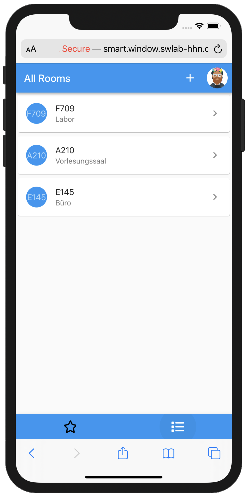
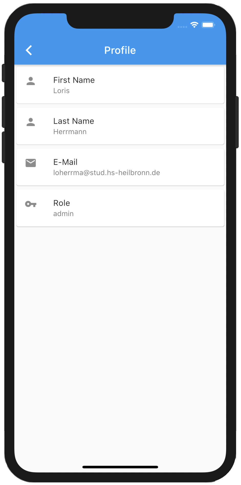
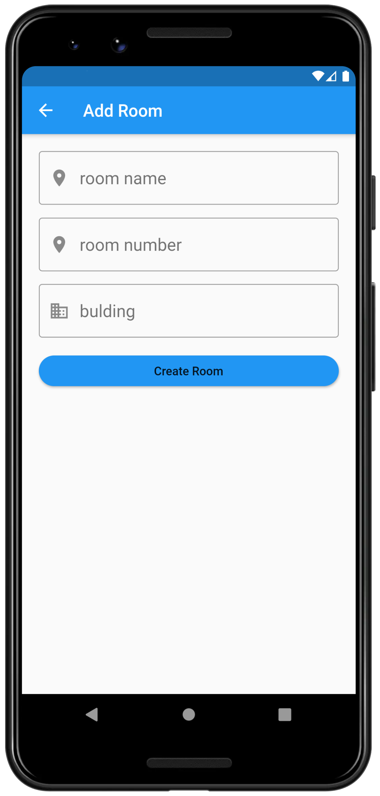

# Smart Window

## Allgemein

Aufgabe der Smart Window App ist es Fenster mittels mobiler Anwendung öffnen und schließen zu können.
Darüber hinaus kann die App verschiedene Sensorwerte anzeigen und Aktoren steuern, nicht nur Fenster. Lichter oder Kaffeemaschinen sind ebenfalls möglich.
Um die Nutzung weiter zu vereinfachen wäre der nächste Schritt den Nutzer Routinen erstellen zu lassen, damit Aktoren bei Sensorwertänderungen (z.B. Regen oder hohe Temperatur) oder um eine gewissen Uhrzeit eine Aktion ausführen.

Das Backend basiert auf TypeScript, NodeJS und ExpressJS. Nutzer, Räume und Geräte werden in einer MongoDB verwaltet, Sensordaten in einer InfluxDB. API mittels Swagger nach OpenAPI3 Standart dokumentiert. Nutzer haben verschiendene Rollen, eine Nutzergruppe kann Räume und Geräte verändern, eine Nutzergruppe kann Geräte steuern aber nicht Räume oder Geräte verändern und die letzte Nutzergruppe kann nur Sensorwerte anschauen. Alle Passwörter sind gehashed und JWT-Token haben eine Lebenszeit von 30 Minuten. Alle eingehenden und ausgehenden Daten werden validiert, Nutzerrechte und Gültigkeit des Token überprüft.

Backend kommuniziert mit den auf ESP32 basierenden Geräten über MQTT.

Frontend entwickelt mit Flutter und Dart, dadurch läuft die App nativ unter Android und iOS aber auch im Web.

Frontend und Backend werden mit Kubernetes in einen Docker Container deployed. Projekt ist in GitLab eingechecked und App wird in BWCloud gehostet.

Unter Android und iOS können neue Geräte mittels QR-Scan hinzugefügt werden, im Web muss die MAC-Adresse abgetippt werden.

## Screenshots

Login Screen

     

Registration Screen, Registrierung ist nur mit gültiger Hochschule Mail möglich. Die Registrierungsmail muss bestätigt werden. 

     

Nach dem Login landet der Nutzende auf seinem Favouriten Screen mit den Räumen, die er zu seinen Favouriten hinzugefügt hat.
 
      
 
 Neben den Favouriten kann er zur Gesamtübersicht wechseln um aus allen Räumen einen Raum auszuwählen.
 
      
 
 In der Detailansicht eines Raums können alle verbundenen Sensorwerte und Aktoren der verknüpften Geräte gesteuert und betrachtet werden. Im Beispiel kann der Nutzer die Innentemperatur, Luftfeuchtigkeit innen sowie die Luftqualität sehen. Darüber hinaus bekommt er angezeigt ob es regnet und die Außentemperatur. Zusätzlich kann er das Fenster öffnen und schließen. 
 
      
 
 Im Profil lassen sich Angaben zum eingeloggten Nutzer betrachten.
 
      
 
 In den Einstellungen kann er die Sprache ändern, Benachrichtigungseinstellungen anpassen, etc.
 
      
 
 Screen zum Hinzufügen eines neuen Raums.
 
      
 
 Screen zum Hinzufügen eines neuen Gerätes.
 
      
